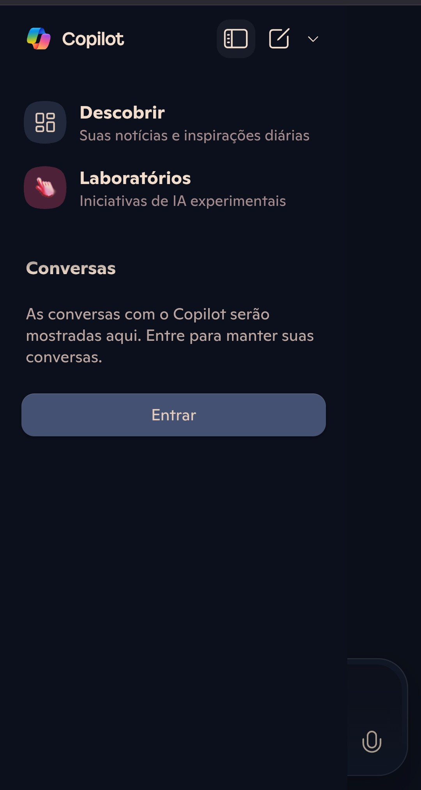
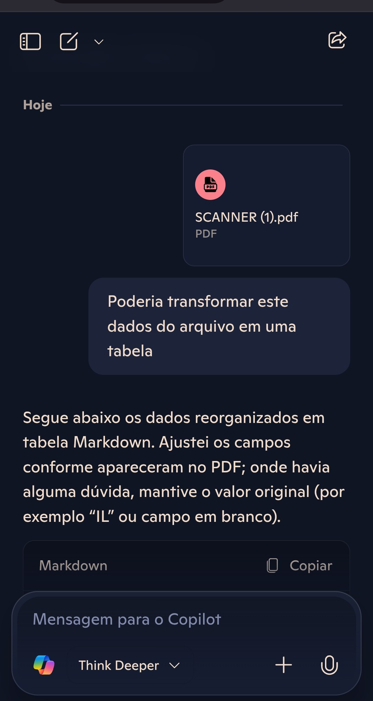
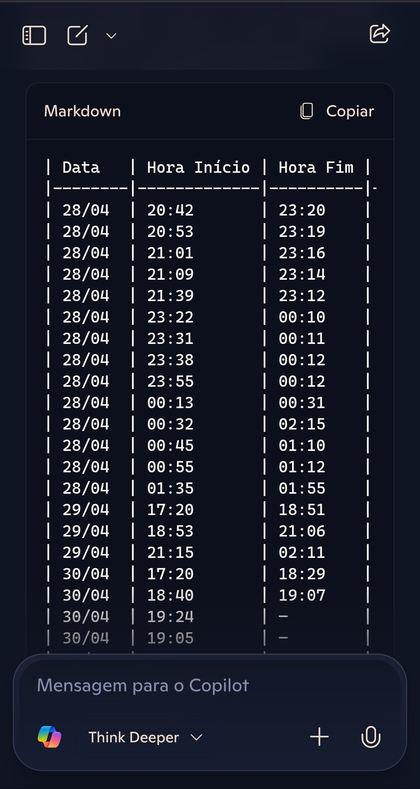
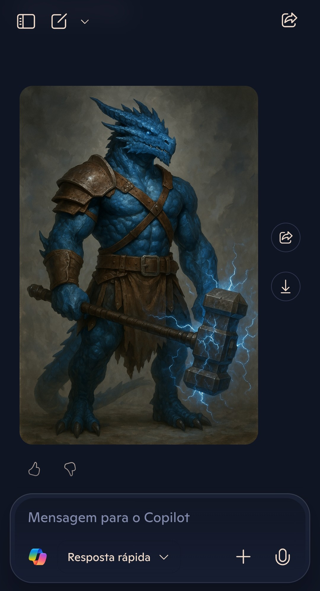

# Apresentando o Copilot

Talvez seja um pouco difícil você não conhecer o copilot mas caso não conheça venha comigo que eu te ajudarei com um tour por está Ia Generativa.

## Interface

Esta é a interface do Copilot aberta pelo navegador do celular

A interface muda, quando abre pelo navegador do computador, adicionando na tela já alguns prompts sugestivos, mas as funções seguem as mesmas, no meu celular uso o fundo noturno e ele já entra com está coloração, não se assuste se o seu aparecer na cor branca esse é o padrão.

## Funcionalidades

Bom a diversidade de funcionalidade do Copilot não para de crescer, vou focar apenas nas disponíveis no site ou aplicativo, mas não posso deixar de mencionar as suas imprecionantes aplicações para o auxílio em códigos com o Github Copilot.

Como podemos ver na imagem abaixo, podemos criar uma nova conversa bem como criar uma página, basicamente funcionando como um macador, para organizar pensamentos ou até mesmo organizar um brainstorm por que não?

E como vou acessar estás paginas e minhas conversas antigas, apenas clique no botão ao lado e abaixo das guias Descobrir e Laboratório, estarão suas paginas e conversas antigas, nas quais podem serem renomeadas ou deletadas a sua escolha, mas o que é Descobrir e Laboratório.

Descobrir funciona da mesma forma que seu aplicativo de música favorito, lhe mostra notícias diversas que seja sugeridas para você, temperatura na sua cidade ou talvez uma receita, já o Laboratório é uma aba de experimentações são algumas coisas novas que a IA está experimentando um entrada.

Na interface inicial na área de chat podemos mudar a forma com que o chat nos responde, se queres funcionalidades mais básicas ou mais complexas, tudo em apenas um toque, o tempo de resposta muda um pouco, mas vale a pena.

Inclusive podemos anexar arquivos, para fazer uma análise, até mesmo pedir uma recomendação ou usar como referência para um prompt.

Como exemplo usei um arquivo de imagem em .jpg, de uma planilha escrita a mão e fiz a solicitação para gerar uma planilha com os dados do arquivo, resultado ele transcreveu os dados gerando uma planilha em Markdown, como outro exemplo solicitei a geração de uma imagem de um personagem para um jogo RPG veja os resultados.

Como podemos ver obtivemos bons resultados com prompts não tão bons, use a criatividade ao seu favor, com responsabilidade e melhore seus resultados, bem como suas entregas, use prompts e sua engenharia ao seu favor, vale salientar que este é apenas uma das diversas funcionalidades do Copilot.

Se você gostou do conteúdo, compartilhe o conhecimento e nos vemos em uma próxima.
